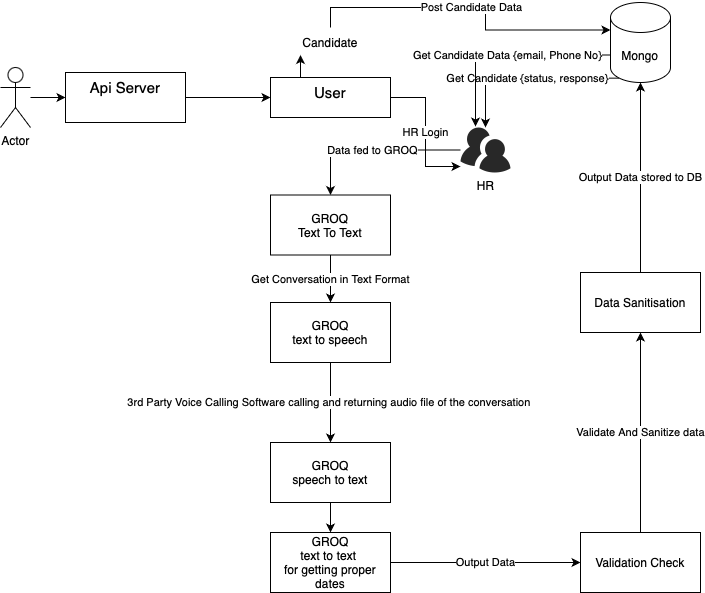

# Time2Hire
## _AI-Automated Interview Scheduling Service_


# VoiceScheduler

**VoiceScheduler** is a smart, voice-interactive, AI-powered interview scheduling system built with Node.js and Groq LLaMA models.

## Features

- 🎙️ Speak naturally with candidates via AI-driven voice chat  
- 📅 Extract structured data like dates, availability, and responses  
- 🔁 Seamless conversion between voice & text  
- 🧠 Powered by LLaMA for intelligent conversation  
- 💾 Automatically stores clean data into MongoDB  
- ✨ Automated scheduling magic ✨

Interview Scheduling is a voice-driven, AI-assisted platform designed to streamline the process of scheduling and managing candidate interviews. It combines modern web technologies with conversational intelligence to deliver an intuitive, user-friendly experience.

As the system diagram illustrates, the core design goal is to keep the flow as smooth and modular as possible — handling candidates, appointments, and voice interactions as individual, well-defined components.

> The primary vision behind Interview Scheduling  
> is to simplify the recruiting process using  
> voice commands and AI — reducing human effort  
> while maintaining a personalized candidate experience.

Everything you interact with is built using Node.js, Express, and Groq's LLaMA-based models. To experience it firsthand, fire up the app and start speaking — the system listens, understands, and schedules.
.

## Architecture



The system architecture consists of the following components:

- **API Server**: Handles all client requests and serves as the central hub
- **User Interface**: Client-side application for interacting with the service
- **MongoDB Database**: Stores candidate information and appointment data
- **HR Module**: Interface for HR professionals to manage the interview process
- **GROQ Integration**:
  - Text-to-text processing
  - Text-to-speech conversion
  - Speech-to-text conversion
  - Intelligent date processing
- **Data Sanitization & Validation**: Ensures data integrity and security

## Tech

This Interview Scheduling system uses a number of open-source projects to work properly:

- [Node.js](https://nodejs.org/) – JavaScript runtime environment for the backend
- [Express](https://expressjs.com/) – Fast and minimal web framework for Node.js
- [bcrypt](https://www.npmjs.com/package/bcrypt) – Password hashing for secure authentication
- [jsonwebtoken](https://www.npmjs.com/package/jsonwebtoken) – Token-based authentication using JWTs
- [cookie-parser](https://www.npmjs.com/package/cookie-parser) – Parse and manage cookies in requests
- [cors](https://www.npmjs.com/package/cors) – Cross-Origin Resource Sharing support
- [dotenv](https://www.npmjs.com/package/dotenv) – Loads environment variables from `.env` file
- [groq-sdk](https://www.npmjs.com/package/groq-sdk) – SDK for accessing Groq’s LLaMA models
- [MongoDB](https://www.mongodb.com/) – NoSQL database for storing candidate and appointment data

And of course, this Interview Scheduling platform is open source and built with ❤️ by Kartikey Sangal.

## Installation

```sh
# Clone the repository
git clone https://github.com/ImKartikey27/Time2Hire.git

# Navigate to the project directory
cd Time2Hire

# Install dependencies
npm install

# Set up environment variables
cp .env.example .env
# Edit .env with your configuration

# Start the application
npm start
```


## Development

Want to contribute? Great!

Time2Hire uses modern development workflows for fast and efficient development.
Make changes in your files and instantaneously see your updates!

Open your favorite Terminal and run these commands:

First Tab:
```sh
node app
```

Second Tab:
```sh
gulp watch
```

## API Documentation

### Authentication

- `POST /api/auth/register` - Register a new HR user
- `POST /api/auth/login` - Login and receive JWT
- `GET /api/auth/logout` - Logout and clear cookies

### Candidates

- `POST /api/candidates` - Create a new candidate profile
- `GET /api/candidates` - List all candidates
- `GET /api/candidates/:id` - Get specific candidate deta
- `PUT /api/candidates/:id` - Update candidate informatio
- `DELETE /api/candidates/:id` - Remove a candidate

### Appointments

- `POST /api/appointments` - Schedule a new interview
- `GET /api/appointments` - View all scheduled interviews
- `GET /api/appointments/:id` - Get specific appointment 
- `PUT /api/appointments/:id` - Update appointment inform
- `DELETE /api/appointments/:id` - Cancel an appointment

### Jobs

- `GET /get-jobs`: Get a list of all job openings.
- `GET /get-job/:id`: Get details of a specific job opening.
- `POST /create-job`: Create a new job (Secured route, JWT required).
- `PUT /update-job/:id`: Update a job listing (Secured route, JWT required).
- `DELETE /delete-job/:id`: Delete a job listing (Secured route, JWT required).

### Voice Commands

- `POST /start/:id`: Start a conversation with a candidate using their `id`.
- `POST /response`: Process a response from the candidate during the conversation.


## Contributing

1. Fork the repository
2. Create your feature branch (`git checkout -b feature/amazing-feature`)
3. Commit your changes (`git commit -m 'Add some amazing feature'`)
4. Push to the branch (`git push origin feature/amazing-feature`)
5. Open a Pull Request

## 🧪 API Testing with Postman

- **Postman Collection**: [Download here](./public/Time2Hire.postman_collection.json)
- Import this collection into Postman to test all available API endpoints.
- Features included:
  - Pre-request scripts for automatic token generation
  - Automated tests for response status codes and data validation

### 🔧 How to Use
1. Open **Postman**
2. Click on **Import** and upload `Time2Hire.postman_collection.json`
3. Run individual endpoints or use the **Collection Runner** to test them all at once
4. Check the **Tests tab** to view validation results

**Free Software, Hell Yeah!**

[//]: # (These are reference links used in the body of this note and get stripped out when the markdown processor does its job. There is no need to format nicely because it shouldn't be seen. Thanks SO - http://stackoverflow.com/questions/4823468/store-comments-in-markdown-syntax)

   [dill]: <https://github.com/joemccann/dillinger>
   [git-repo-url]: <https://github.com/joemccann/dillinger.git>
   [john gruber]: <http://daringfireball.net>
   [df1]: <http://daringfireball.net/projects/markdown/>
   [markdown-it]: <https://github.com/markdown-it/markdown-it>
   [Ace Editor]: <http://ace.ajax.org>
   [node.js]: <http://nodejs.org>
   [Twitter Bootstrap]: <http://twitter.github.com/bootstrap/>
   [jQuery]: <http://jquery.com>
   [@tjholowaychuk]: <http://twitter.com/tjholowaychuk>
   [express]: <http://expressjs.com>
   [AngularJS]: <http://angularjs.org>
   [Gulp]: <http://gulpjs.com>

   [PlDb]: <https://github.com/joemccann/dillinger/tree/master/plugins/dropbox/README.md>
   [PlGh]: <https://github.com/joemccann/dillinger/tree/master/plugins/github/README.md>
   [PlGd]: <https://github.com/joemccann/dillinger/tree/master/plugins/googledrive/README.md>
   [PlOd]: <https://github.com/joemccann/dillinger/tree/master/plugins/onedrive/README.md>
   [PlMe]: <https://github.com/joemccann/dillinger/tree/master/plugins/medium/README.md>
   [PlGa]: <https://github.com/RahulHP/dillinger/blob/master/plugins/googleanalytics/README.md>
